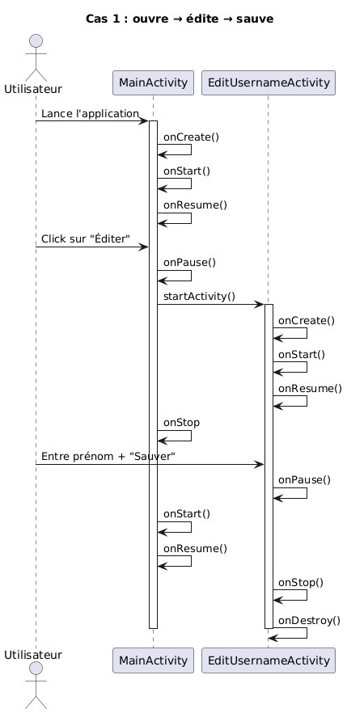
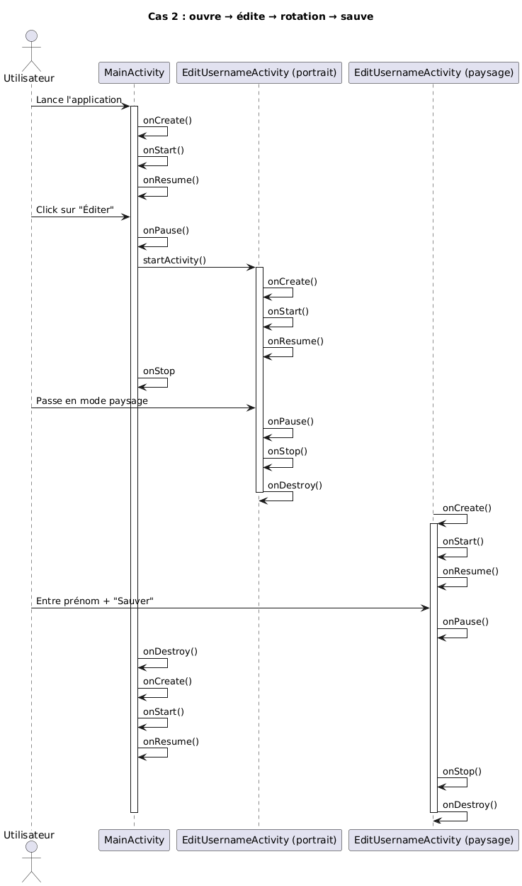

# DAA - labo2
# Auteurs : Bleuer Rémy, Changanaqui Yoann, Rajadurai Thirusan
# Date : 03.10.2025
# Classe_Groupe : DAA_B_9

## Introduction
Ce laboratoire à pour but de nous familiariser avec les bases du développement Android en utilisant Kotlin.
Ce labo vise particulièrement les Activités et les Fragments. Aux travers de trois manipulations différentes, nous
entraînons la navigation entre les activités, les cycles de vie d'un activité, l'utilisation et la gestion de fragments.
Le but final de ce labo est de nous faire comprendre comment Android gères ces différents composants, afin d'utiliser 
les meilleures pratiques pour s'assurer d'avoir une application robuste et réactive.

## Exercice 1 : Les Activités

### Choix d'implémentations
Il y a deux activités distinctes, une première `MainActivity` qui affiche le message de bienvenue,
et `EditUsernameActivity` qui permet de choisir un nom et de l'envoyer à la première.

Utilisation des contracts de la librairie `AndroidX` avec `registerForActivityResult` comme vu
lors de la théorie.

Utilisation de `Log.d` dans chaque méthode pour logger les différents chemins parcourus.

Utilisation d'un `ConstrainLayout` afin de pouvoir centrer horizontallement et verticallement dans 
le parent.

### Questions
- Que se passe-t-il si l’utilisateur appuie sur « back » lorsqu’il se trouve sur la seconde Activité ?

Il revient à la première activité sans modification du texte. Ceci dans les deux cas, que ça
soit le message de bienvenue par défaut ou le message modifié avec un nouveau nom.

- Veuillez réaliser un diagramme des changements d’état des deux Activités pour les utilisations
suivantes, vous mettrez en évidence les différentes instances de chaque Activité :
  - L’utilisateur ouvre l’application, clique sur le bouton éditer, renseigne son prénom et
  sauve.

  
  
  - L’utilisateur ouvre l’application en mode portrait, clique sur le bouton éditer, bascule en
  mode paysage, renseigne son prénom et sauve.

  

- Que faut-il mettre en place pour que vos Activités supportent la rotation de l’écran ? Est-ce
nécessaire de le réaliser pour les deux Activités, quelle est la différence ?

Il faut sauvegarder l'état de l'activité avant la rotation et le restaurer après.
Seulement dans `MainActivity` car c'est la seule activité qui a un état à conserver (le nom).
Dans `EditUsernameActivity, le champ de texte restaure son contenu automatiquement.

### Tests
| Test effectué                                        | Résultat attendu                                             | Résultat obtenu    |
|------------------------------------------------------|--------------------------------------------------------------|--------------------|
| Ouvrir l'application                                 | Affichage du "Bonjour"                                       | OK                 |
| Cliquer sur le bouton éditer                         | Affichage d'un champ de text avec un bouton sauver           | OK                 |
| Cliquer sur le bouton sauver avec un nom             | Affichage du "Bonjour + nom"                                 | OK                 |
| Cliquer sur le bouton sauver avec champ vide         | Il ne devrait pas avoir de modification du message précédent | KO le nom est vide |
| Rotation de l'écran                                  | Les texts et les boutons s'adaptent à l'écran                | OK                 |
| Cliquer sur le bouton "back" depuis la 2ème activité | Retour à la 1ère activité sans changement de text            | OK                 |

## Exercice 2 : Les Fragments, premiers pas

## Exercice 3 : Le FragmentManager

## Conclusion

TODO
