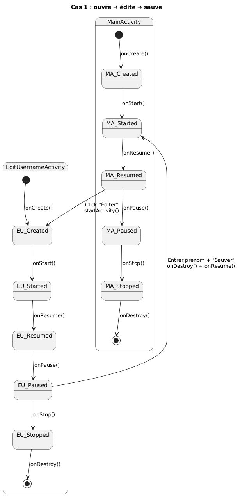
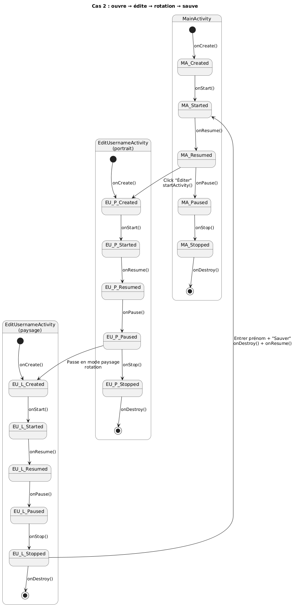

\pagebreak

## Introduction
Ce laboratoire à pour but de nous familiariser avec les bases du développement Android en utilisant Kotlin.
Ce labo vise particulièrement les Activités et les Fragments. Aux travers de trois manipulations différentes, nous
entraînons la navigation entre les activités, les cycles de vie d'un activité, l'utilisation et la gestion de fragments.
Le but final de ce labo est de nous faire comprendre comment Android gères ces différents composants, afin d'utiliser 
les meilleures pratiques pour s'assurer d'avoir une application robuste et réactive.

## Exercice 1 : Les Activités

### Choix d'implémentations
Il y a deux activités distinctes, une première `MainActivity` qui affiche le message de bienvenue,
et `EditUsernameActivity` qui permet de choisir un nom et de l'envoyer à la première.

Utilisation des contracts de la librairie `AndroidX` avec `registerForActivityResult` comme vu
lors de la théorie.

Utilisation de `Log.d` dans chaque méthode pour logger les différents chemins parcourus.

Utilisation d'un `ConstrainLayout` afin de pouvoir centrer horizontallement et verticallement dans 
le parent.

### Questions
- Que se passe-t-il si l’utilisateur appuie sur « back » lorsqu’il se trouve sur la seconde Activité ?

Il revient à la première activité sans modification du texte. Ceci dans les deux cas, que ça
soit le message de bienvenue par défaut ou le message modifié avec un nouveau nom.

- Veuillez réaliser un diagramme des changements d’état des deux Activités pour les utilisations
suivantes, vous mettrez en évidence les différentes instances de chaque Activité :

  J'ai mal lu l'énnoncé et ai commencé par des diagrammes de séquence, ils sont à dispositions dans le dossier [images](./images)

  - L’utilisateur ouvre l’application, clique sur le bouton éditer, renseigne son prénom et
  sauve.

  
  
  - L’utilisateur ouvre l’application en mode portrait, clique sur le bouton éditer, bascule en
  mode paysage, renseigne son prénom et sauve.

  

- Que faut-il mettre en place pour que vos Activités supportent la rotation de l’écran ? Est-ce
nécessaire de le réaliser pour les deux Activités, quelle est la différence ?

Il faut sauvegarder l'état de l'activité avant la rotation et le restaurer après.
Seulement dans `MainActivity` car c'est la seule activité qui a un état à conserver (le nom).
Dans `EditUsernameActivity, le champ de texte restaure son contenu automatiquement.

### Tests
| Test effectué                                        | Résultat attendu                                             | Résultat obtenu    |
|------------------------------------------------------|--------------------------------------------------------------|--------------------|
| Ouvrir l'application                                 | Affichage du "Bonjour"                                       | OK                 |
| Cliquer sur le bouton éditer                         | Affichage d'un champ de text avec un bouton sauver           | OK                 |
| Cliquer sur le bouton sauver avec un nom             | Affichage du "Bonjour + nom"                                 | OK                 |
| Cliquer sur le bouton sauver avec champ vide         | Il ne devrait pas avoir de modification du message précédent | KO le nom est vide |
| Rotation de l'écran                                  | Les texts et les boutons s'adaptent à l'écran                | OK                 |
| Cliquer sur le bouton "back" depuis la 2ème activité | Retour à la 1ère activité sans changement de text            | OK                 |

## Exercice 2 : Les Fragments, premiers pas

## Exercice 3 : Le FragmentManager

## Questions

• A l’initialisation de l’Activité, comment peut-on faire en sorte que la première étape s’affiche automatiquement ?
```xml
<androidx.fragment.app.FragmentContainerView  
android:id="@+id/fragment_container"  
android:layout_width="0dp"  
android:layout_height="0dp"  
android:name="ch.heigvd.iict.daa.template.Step" <!-- ici -->
app:layout_constraintTop_toBottomOf="@id/appbarlayout"  
app:layout_constraintBottom_toTopOf="@id/buttons"  
app:layout_constraintStart_toStartOf="parent"  
app:layout_constraintEnd_toEndOf="parent">  
</androidx.fragment.app.FragmentContainerView>
```

Dans le code du layout *(donc le xml)* on ajoute la **référence** de la classe de notre fragment dans le composant **FragmentContainerView** qui devra être instancié lors de l’affichage de la vue de l’Activité *(OnCreate)*.

>se référer au support de cours "3 - Les briques de base - Activités, Fragments et Services" Slide 41

### Comment pouvez-vous faire en sorte que votre implémentation supporte la rotation de l’écran ? Nous nous intéressons en particulier au maintien de l’état de la pile de Fragments et de l’étape en cours lors de la rotation.

En effet, lorsqu'il y a une rotation de l'écran *(passage au mode "landscape")*, la pile de Fragments est recréée à l’identique par le **FragmentManager**, mais pas l’**état interne** des Fragments.

>se référer au support de cours "3 - Les briques de base - Activités, Fragments et Services" Slide 45

Autrement dit lorsque l'écran pivote, mon activité **MainActivityFragment2.kt** est détruite, on passe à celle dédié pour le mode landscape.Donc la variable **id** n'existe plus. Une nouvelle instance de l'activité est créée, `onCreate()` est rappelé, et `id` est réinitialisé à 0. Même si mon **FragmentManager** peut restaurer la pile de fragments mon compteur id lui est perdu.

La solution consiste à **sauvegarder** l'id lorsque l'activité est sur le point d'être détruite grâce à la méthode à la méthode `onSaveInstanceState(bundle)`. Puis de la restaurer lorsque la nouvelle instance est créée, `onViewStateRestored(bundle)`.

>La [documentation](https://developer.android.com/reference/android/app/Activity#onSaveInstanceState(android.os.Bundle)) officielle

### Dans une transaction sur le Fragment, quelle est la différence entre les méthodes `add` et `replace` ?

La méthode `add()` ajoute un nouveau fragment au-dessus de ce qui existe déjà dans le conteneur. Si un fragment est déjà présent dans le conteneur, `add()` place le nouveau fragment par-dessus l'ancien. On le remarque avec notre exercice car les *ids* affichés se superposent.
Les deux fragments sont techniquement dans le conteneur en même temps. Le fragment précédent n'est pas détruit. Son cycle de vie continue *(pas de `onDestroy()`)*, mais il passe à l'état `onStop()`.

La méthode `replace()` remplace le fragment actuellement dans le conteneur par un nouveau. C'est l'équivalent d'un appel à `remove()` pour l'ancien fragment, suivi d'un appel à `add()` pour le nouveau.
Le fragment existant est complètement retiré de la vue avant que le nouveau ne soit ajouté. À tout moment, il n'y a qu'**un seul fragment** géré activement dans le conteneur.

A noter que je sauvegarde les fragments dans une "backstack" géré par le FragmentTransaction *(ou FragmentManager)* avec l'appel à `.addToBackStack(null)`

>Voir plus dans la [documentation](https://developer.android.com/reference/androidx/fragment/app/FragmentTransaction#add(int,%20java.lang.Class%3C?%20extends%20androidx.fragment.app.Fragment%3E,%20android.os.Bundle)) officielle

## Choix d'implémentations

En ce qui concerne l'implémentation, elle a majoritairement été discuté lors de la section questions-réponses.

Néanmoins il est intéressant de rappeler l'architecture employé pour la réalisation de cette partie :
```txt
app/
 | - kotlin+java/
 |	  | - ch.heigvd.iict.daa.template/
 |	  		| - MainActivityFragment2.kt
 |	  		| - Step.kt
 | - res/
 |	  | - layout
 |	  		| - fragmentmanager_activity.xml
 |	  		| - fragment_step.xml
```

On retrouve les éléments tel que, `fragmentmanager_activity.xml` qui est le layout qui contient lui même un `FragmentContainerView` qui contiendra au lancement de l'application mon second layout `fragment_step.xml` *(la vue du fragment/design)*.

`MainActivityFragment2.kt` est le programme qui lance l'activité *(on en a qu'une seule pour cette exercice)*. C'est-elle qui gère le **FragmentTransaction** donc tout ce qui concerne la pile de fragments et d'états. Ainsi que `Step.kt` qui permet de manipuler le fragment.

## Tests
| Test effectué                                           | Résultat attendu                                                  | Résultat obtenu |
| ------------------------------------------------------- | ----------------------------------------------------------------- | --------------- |
| Ouvrir l'application                                    | Affichage d'un fragment par défaut                                | OK              |
| Appuyer sur le bouton **Back** sans ajouté de fragments | rien                                                              | OK              |
| Appuyer sur le bouton **Close**                         | Ferme l'activité *(application)*                                  | OK              |
| Appuyer sur le bouton **Next**                          | Génère un nouveau fragment avec l'id suivant                      | OK              |
| Appuyer sur le bouton **Back** après ajout de fragments | Revient au fragment précédent et retire l'ancien                  | OK              |
| Rotation de l'écran                                     | Etat de la pile ainsi que l'état interne des fragments sauvegardé | OK              

## Conclusion

TODO


